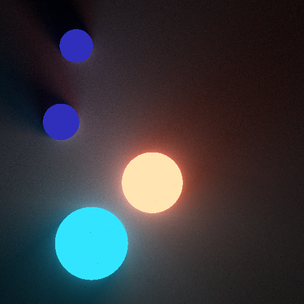

# Light2D

This project illustrates light rendering in 2D with C++

All image output PNGs with svpng

## Getting Started

This project use ray tracing method to render circle and relize reflection.
Normal and intersectoin are calculated during the computing.  

These instructions will get you a copy of the project up and running on your local machine for development and testing purposes. See deployment for notes on how to deploy the project on a live system.

### Example

## Built With

* [svpng](https://github.com/miloyip/svpng) - Minimalistic C function for saving RGB/RGBA image as uncompressed PNG.

## Authors

* **Wang Xicheng**
