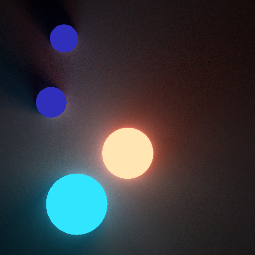

# Light2D

This project illustrates light rendering in 2D with C++. Use ray tracing method to render circle and realize reflection.

All image output PNGs with svpng

drawLight01.exe has been added to [/bin](https://github.com/LOOK2001/Light2D/tree/master/bin) (only for 64 bit on Windows)

## Example

## Built With

* [svpng](https://github.com/miloyip/svpng) - Used to save RGB/RGBA image as uncompressed PNG.

## Authors

* **Wang Xicheng**
